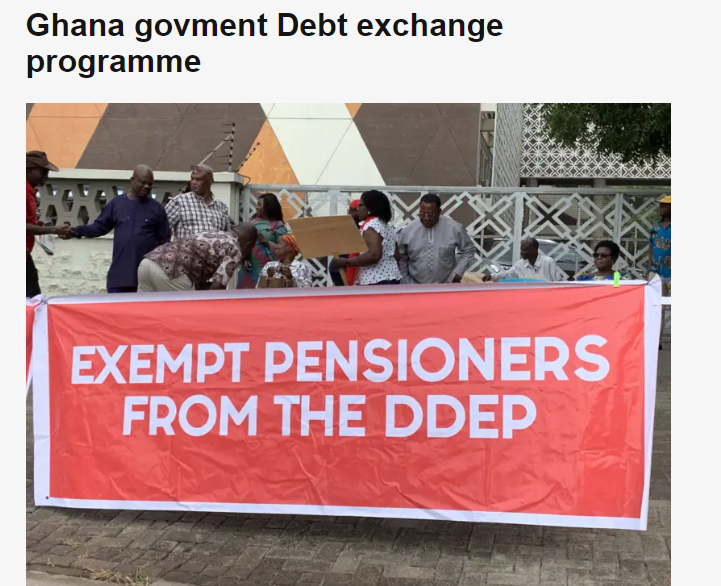
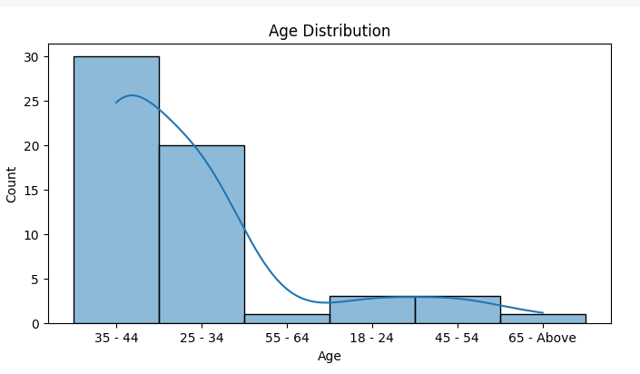
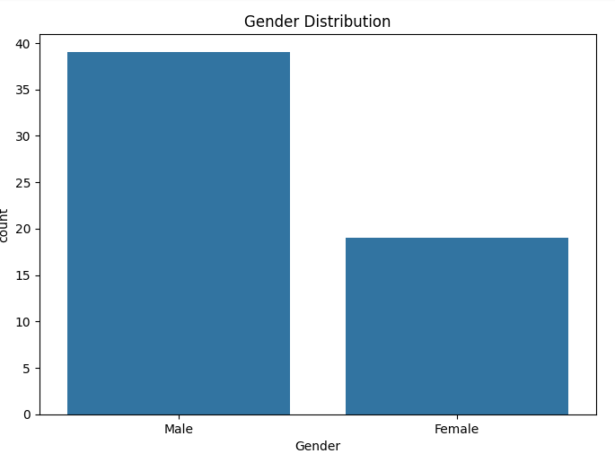
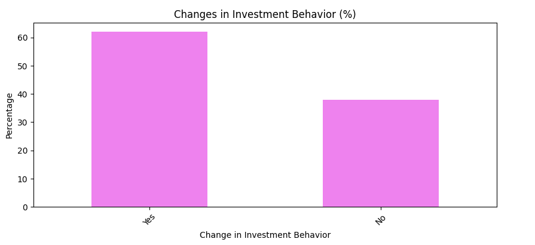
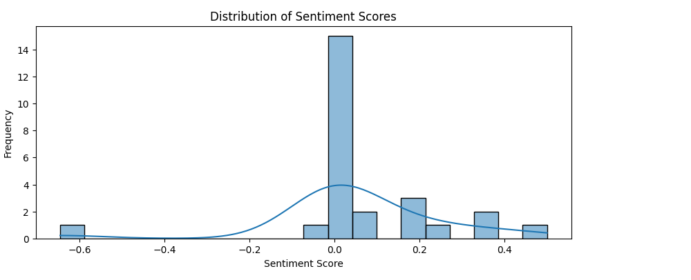
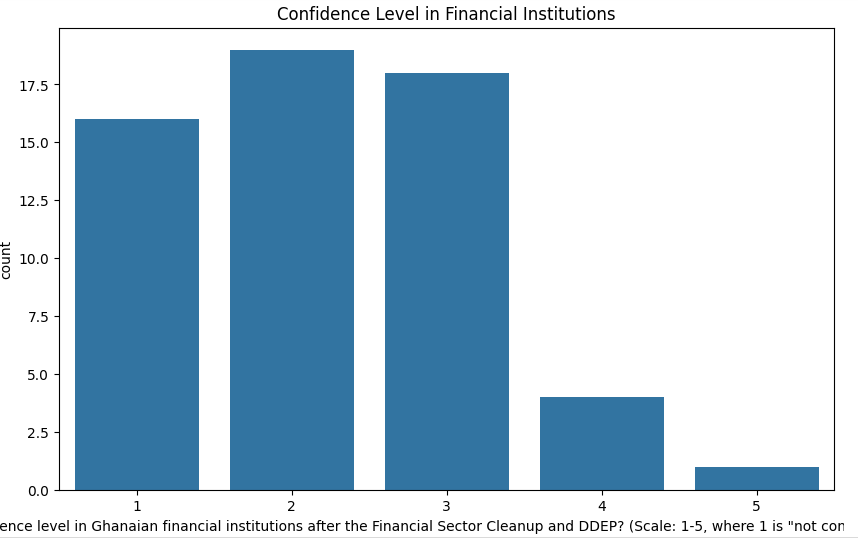

# Analyzing the impact of Ghana’s financial sector cleanup and domestic debt exchange program (ddep) on personal savings, investment, and confidence in financial institutions: a business analytics perspective

# Introduction
The financial landscape of Ghana has witnessed substantial transformations in recent years, marked by significant policy interventions such as the Financial Sector Cleanup and the introduction of the Domestic Debt Exchange Program (DDEP). These initiatives, undertaken by the Bank of Ghana, reflect a proactive approach to address systemic challenges and restore stability within the financial sector (Bank of Ghana, 2019).
The revocation of licenses from insolvent savings and loan companies, finance houses, and non-bank financial institutions, as well as the appointment of receivers, highlights the gravity of the situation and the imperative need for decisive actions to safeguard depositors' interests and mitigate risks to the financial system (Bank of Ghana, 2019). Additionally, implementing the Domestic Debt Exchange Program seeks to alleviate the country's debt burden transparently and efficiently, aiming to restore fiscal sustainability and support economic growth (Ministry of Finance, 2022).

# Objective
The objective of this study was to analyse trends in savings and investment behaviours, assess the confidence levels in financial institutions, and provide insights for improving financial strategies. The study aimed to gather quantitative and qualitative data to achieve a comprehensive understanding of the subject matter.

# Scope of the study
The scope of the study encompassed an analysis of individual savings and investment behaviours, confidence levels in financial institutions, and expert opinions on current financial trends. The purpose was to identify key trends, provide actionable recommendations, and suggest areas for further research.

# Purpose of the study
The purpose of this study is to evaluate the effects of Ghana's Financial Sector Cleanup and Domestic Debt Exchange Program (DDEP) on personal savings behaviour, investment patterns, and public confidence in financial institutions. Through a business analytics perspective, the study aims to provide data-driven insights that can inform policymakers, regulators, financial institutions, and investors about the implications of these financial reforms. The goal is to understand the extent to which these interventions have succeeded in restoring stability and fostering trust within the financial ecosystem, as well as to identify areas for potential improvement and further research.

# Literature Review
The literature review covered various aspects of financial behaviour, including factors influencing savings and investment decisions, the role of financial institutions in shaping these behaviors, and previous studies on data visualization in financial analysis. This review provided a theoretical framework and contextual background for the study.

# Reseearch Methodology
A mixed-methods approach was employed for this study. The total sample size was 78, consisting of 58 responses collected via social media platforms through a questionnaire distribution. Insights were gathered from 10 financial industry experts through expert interviews, and qualitative data was obtained from a focus group discussion involving 10 participants. Python was used for data visualisation, while Excel was employed for data cleansing.

# Data Analysis
The data analysis for this study was conducted using a combination of Python (Google Colab and Jupyter Notebook) and Excel. Visual images and graphs were generated using Python and Google Forms to provide detailed data visualizations. Additionally, sentiment analysis was performed using Python to evaluate public sentiment and reactions to the financial reforms.
# Demographics
## Age Distribtion
    
25 - 34: 25%
35 - 44: 20%
45 - 54: 15%
55 - 64: 5%
65 - Above: 5%

## Gender Distribution   
 

## Savings Behaviour
 

A significant number of respondents reported changes in their savings behaviour due to the Financial Sector Cleanup and DDEP.
Based on the bar chart results as depicted in the above data, when asked if they noticed any changes in their personal savings behaviour since the implementation of Ghana's Financial Sector Cleanup and DDEP, 84.5% of respondents answered "yes," 13.8% answered "no," and 1.7% selected "other." For those who specified changes in their savings behaviour, 65.5% indicated decreased savings, 12.1% reported increased savings, and 10.3% noted no change in their savings ehavior. Additionally, 10.3% selected "other" as their response, while 1.7% experienced both decreased savings and no change in their savings behaviour.

## Investment Behaviour
 

Based on the bar chart results as shown above, respondents who specified changes in their investment patterns reported the following: 44.8% indicated reduced investments, 17.2% diversified their investment portfolio, and 13.8% selected "other" as their response. Additionally, 8.6% both diversified their investment portfolio and reduced their investments; 3.4% changed their risk tolerance and increased investments; and another 3.4% diversified their investment portfolio, changed their risk tolerance, and reduced investments. Furthermore, 1.7% diversified their investment portfolio and increased investments, 1.7% changed their risk tolerance, 1.7% changed their risk tolerance and reduced investments, 1.7% reduced investments and selected "other," and 1.7% diversified their investment portfolio and changed their risk tolerance.

## Sentimental Analysis

### Sentiment Score Distribution

The histogram displays the frequency of sentiment scores among the respondents. Most sentiment scores are clustered around neutral to slightly positive values.
The sentiment scores ranged from approximately -0.6 (most negative) to 0.5 (most positive), indicating diverse opinions among the respondents.

#### Sentiment Category Counts
Neutral Sentiment
The majority of the comments (18 out of 26) were neutral, suggesting that many respondents did not express strong positive or negative feelings about the impact of the financial reforms.

#### Positive Sentiment
Seven comments were classified as positive, indicating a portion of the respondents viewed the financial sector cleanup and DDEP favourably.
#### Negative Sentiment
Only one comment was classified as negative, showing minimally strong opposition or dissatisfaction among the respondents.
#### Response Rate
Out of a total of 58 respondents, only 26 filled out the portion of the forms related to additional comments or insights. This suggests that the sentiment analysis represents only a portion of the total respondents and may not fully capture the overall sentiment of the entire group.

## Confidence Level

The bar chart illustrates the distribution of confidence levels in Ghanaian financial institutions after the Financial Sector Cleanup and DDEP on a scale from 1 to 5, where 1 represents "not confident at all" and 5 represents "extremely confident." The chart shows that the majority of respondents have low to moderate confidence in financial institutions, with the highest counts observed at confidence levels 2 and 3. Specifically, approximately 17.5 respondents rate their confidence level as 2, and around 17 respondents rate it as 3, indicating that a substantial portion of the population feels somewhat uncertain about the stability and reliability of financial institutions.
Additionally, a significant number of respondents, about 15, have the lowest confidence level, rated as 1, reflecting a notable lack of trust. In contrast, higher confidence levels are less frequent, with only a small number of respondents, around 5, rating their confidence as level 4, and even fewer, approximately 2, rating it as level 5. This suggests that very few individuals feel extremely confident in the financial institutions post-cleanup and DDEP.
Overall, the data indicates a prevailing sentiment of scepticism and moderate trust among the population regarding Ghanaian financial institutions following the financial sector reforms. This distribution highlights the need for continued efforts to rebuild trust and confidence in the financial sector.
Respondents' confidence in financial institutions varied, with a considerable number expressing low confidence post-cleanup.

# Findings
A significant number of respondents indicated low confidence (levels 1 and 2), reflecting the adverse impact on the overall confidence levels in financial institutions. This trend is especially pronounced among older age groups, particularly those aged 65 and above. Younger age groups (18-24) tend to have a slightly higher and more varied confidence level, but confidence still skews towards the lower end of the scale. A large proportion (44.8%) of respondents have reduced their investments as a result of the Financial Sector Cleanup and DDEP. A notable portion (17.2%) have diversified their investment portfolios, indicating a shift towards spreading risk. Other notable changes include a combination of reduced investments and diversified portfolios, changes in risk tolerance, and some increased investments. A significant majority (65.5%) have decreased their savings since the implementation of the Financial Sector Cleanup and DDEP. Only a small fraction (12.1%) has increased their savings, while 10.3% have experienced no change in their savings behavior. The remaining respondents (10.3%) specified other changes or a combination of decreased savings and unchanged behavior. The general sentiment, based on additional comments, indicates a mixture of skepticism and cautious optimism. While some individuals appreciate the intent behind the cleanup, there is concern about its immediate negative impact on personal finances and trust in financial institutions.

# Suggestions 
Financial institutions and regulatory bodies should improve communication regarding the goals, processes, and expected outcomes of the Financial Sector Cleanup and DDEP. Clear, transparent, and frequent updates can help rebuild trust and confidence. Implement educational programs to inform the public about investment diversification, risk management, and savings strategies. This can empower individuals to make informed financial decisions amidst the ongoing changes. Provide support programs and advisory services to those significantly impacted by the cleanup and DDEP, offering guidance on how to manage their finances effectively. Develop and promote financial products tailored to different age groups and their specific needs and concerns. For instance, products that offer higher security and lower risk may appeal more to older individuals, while younger individuals might be more receptive to innovative investment opportunities. Continue to strengthen the regulatory framework to ensure the stability and reliability of financial institutions. This includes strict adherence to international best practices and standards. Encourage financial institutions to adopt better governance practices and risk management strategies to prevent future crises.

# Recommendations
Establish regular monitoring and feedback mechanisms to gauge public sentiment and confidence levels in financial institutions. This can help in making timely adjustments to policies and strategies. Introduce incentives to encourage savings and investments, such as tax benefits, higher interest rates on savings accounts, and lower transaction fees. This can help mitigate the negative impact on personal savings and investments. Launch public awareness campaigns to highlight the long-term benefits of the Financial Sector Cleanup and DDEP. Emphasise the measures taken to protect investors and savers and the steps towards a more robust financial sector. Engage various stakeholders, including financial experts, community leaders, and the public, in discussions about the ongoing financial sector reforms. Collaborative efforts can foster a sense of ownership and collective responsibility towards achieving financial stability. By implementing these suggestions and recommendations, the negative perceptions and behaviours towards savings and investments can be mitigated, leading to a more confident and financially secure population.

# Conclusions
The Financial Sector Cleanup and Domestic Debt Exchange Program (DDEP) in Ghana have had a significant impact on personal savings, investment behaviours, and confidence in financial institutions. The findings indicate a widespread reduction in investments and savings, coupled with a substantial decline in confidence levels across various age groups. The data reveals that the older population, in particular, exhibits lower confidence in financial institutions, which could be attributed to their higher reliance on stable financial returns and greater exposure to the adverse effects of the cleanup.
Despite the negative short-term impacts, the cleanup and DDEP are crucial for establishing a more resilient and transparent financial sector in the long run. The intent behind these reforms is to eliminate systemic risks, enhance regulatory oversight, and foster a healthier financial environment. However, the immediate adverse effects on personal finances and public trust necessitate concerted efforts to mitigate these impacts.
To address these challenges, financial institutions and regulatory bodies must improve transparency and communication, offer educational programs, and provide support to those affected. Tailored financial products and services, aligned with the needs and risk appetites of different demographics, can help restore confidence and encourage positive financial behaviours.
Moreover, ongoing monitoring, public engagement, and collaborative efforts among stakeholders are essential to ensuring the successful implementation and acceptance of these reforms. Incentivising savings and investments through favourable policies can also play a pivotal role in reversing the current negative trends.
In conclusion, while the Financial Sector Cleanup and DDEP have introduced immediate challenges, they are necessary steps towards a more robust and secure financial system in Ghana. By addressing the concerns and needs of the population, fostering transparency, and promoting financial literacy, Ghana can achieve a balanced and resilient financial sector that benefits all stakeholders in the long term.
 

